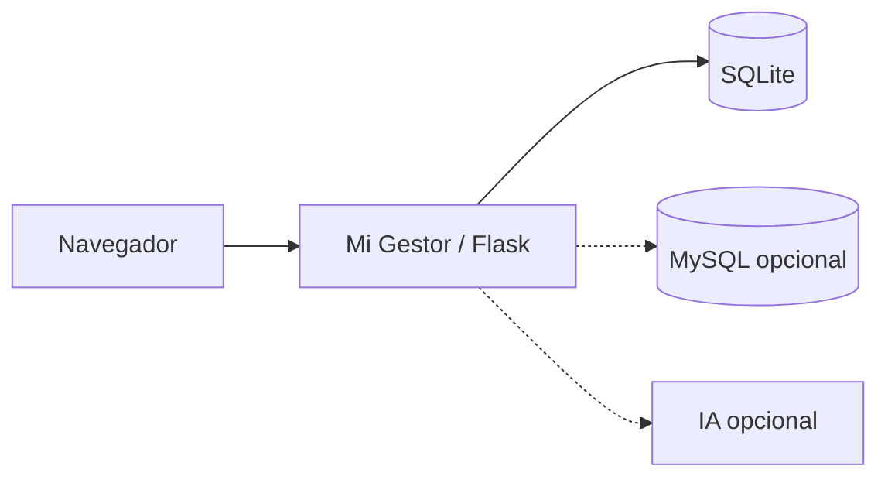
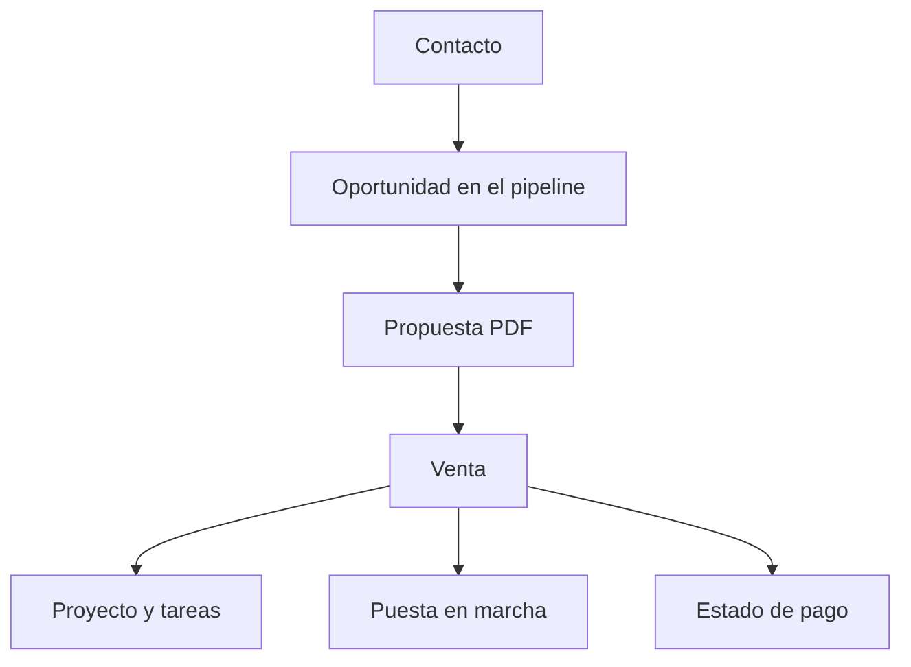
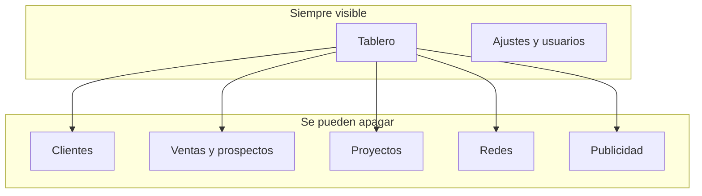

# Mi Gestor

Mi Gestor es un CRM para quien vende y entrega servicios con un equipo pequeño: una persona independiente, un estudio o una agencia chica. Junta en un solo lugar a quién hay que escribir hoy, en qué etapa está cada oportunidad, qué trabajo hay que entregar y qué ventas ya se registraron.

No hace falta una cuenta externa ni una clave de inteligencia artificial para usarlo. La base local es un archivo SQLite. MySQL y la IA son opcionales.

## Para qué sirve

Sirve cuando el seguimiento vive en chats, planillas y la memoria. Con Mi Gestor se puede ver el día, el embudo y los proyectos sin armar un sistema aparte para cada cosa.

- **El día de trabajo.** El tablero muestra publicaciones pendientes, prospectos, tareas próximas y seguimientos que vencen.
- **Los clientes.** Cada ficha guarda contacto, redes, notas y el historial de llamadas, WhatsApp y demos.
- **La venta.** El pipeline lleva al prospecto desde el primer contacto hasta ganado o perdido. De ahí salen propuestas en PDF, ventas, comisiones y una lista de puesta en marcha.
- **La entrega.** Los proyectos tienen fechas, tareas y una vista tipo Gantt. Se puede partir de una plantilla.
- **La presencia.** Redes, calendario editorial y un módulo de publicidad para convertir materiales en borradores.
- **Más de un negocio.** Cada negocio tiene su marca, sus módulos y sus datos. Una persona de un negocio no ve los clientes del otro.
- **Sin depender de nadie más.** Se instala en el computador, el primer usuario se crea en un asistente y los ejemplos son optativos y ficticios.

Lo que todavía no está: agenda única para completar tareas, Kanban, caja, cuotas, portal para el cliente final y trabajo sin conexión. El detalle de eso está en `docs/AVANCE.md`.

## Cómo está armado



El navegador habla con una aplicación Flask. Si no configuras base de datos, todo queda en `data.sqlite`. Si indicas un servidor MySQL, usa esa base. Las funciones de texto e imagen solo llaman a un proveedor si pegas una clave; si no, el resto del programa sigue igual.



Esas piezas ya conviven en la misma ficha de cliente y en el mismo negocio. El cobro hoy es el estado de pago de la venta, no un libro de caja.



Apagar un módulo esconde sus pantallas y responde que la ruta no existe. No borra lo ya guardado. Al volver a encenderlo, la información sigue ahí.

## Qué incluye cada área

| Área | Ruta | Qué hace |
| --- | --- | --- |
| Inicio | `/setup` | Crea al propietario, el negocio, la moneda, la zona y los módulos. Solo la primera vez. |
| Acceso | `/login` | Entran las personas creadas en el asistente o en Ajustes. |
| Tablero | `/` | Resumen del día, embudo y alertas. |
| Clientes | `/clientes` | Fichas e interacciones. |
| Comercial | `/pipeline`, `/propuestas`, `/ventas` | Embudo, mensajes, PDF, ventas, comisiones, onboarding e importación. |
| Prospectos | `/prospectos` | Leads, borrador de mensaje y paso a cliente. |
| Proyectos | `/proyectos` | Tareas, Gantt y plantillas. |
| Redes | `/redes` | Publicaciones, calendario y métricas cargadas a mano. |
| Publicidad | `/publicidad` | Materiales y estudio de borradores. |
| Ajustes | `/ajustes` | Módulos, personas, otro negocio y respaldo SQLite. |

Roles que ya existen: propietario, administrador, vendedor y colaborador. El vendedor trabaja clientes y ventas. El colaborador trabaja clientes y proyectos. Desactivar a una persona le cierra la sesión.

El catálogo de ejemplo, si lo pides en el asistente, trae cuatro productos ficticios: Agenda de reservas, Sitio web, Campañas y Otro. No son precios de un negocio real.

## Instalación

Hace falta Python 3.11 o superior. En esta copia se probó con Python 3.11 en Windows. Los comandos de Linux son los equivalentes habituales; no se ejecutaron en un equipo Linux.

### Windows

```powershell
git clone https://github.com/FernandoLizana/mi-gestor.git mi-gestor
cd mi-gestor
python -m venv .venv
.\.venv\Scripts\Activate.ps1
pip install -r requirements.txt
copy .env.example .env
```

Abre `.env` y cambia `SECRET_KEY` por una cadena larga y aleatoria. No dejes la del ejemplo si alguien más puede entrar al servidor.

```powershell
.\.venv\Scripts\python.exe run.py
```

Abre http://127.0.0.1:5001 . La primera visita va a `/setup`. Ahí creas tu nombre, correo y contraseña (mínimo 8 caracteres), el nombre del negocio y el tipo de actividad. Los ejemplos ficticios solo se cargan si marcas esa casilla.

### Linux

```bash
git clone https://github.com/FernandoLizana/mi-gestor.git mi-gestor
cd mi-gestor
python3 -m venv .venv
source .venv/bin/activate
pip install -r requirements.txt
cp .env.example .env
python run.py
```

El servidor de desarrollo escucha en `127.0.0.1:5001`. No lo uses tal cual en internet. Para un servidor propio hace falta un servidor WSGI, HTTPS y una `SECRET_KEY` distinta. `mount.py` permite colgar la misma aplicación bajo un prefijo como `/crm` mediante la variable `CRM_MOUNT_PATH`.

## Configuración

El archivo que se versiona es `.env.example`. El `.env` real no se sube.

| Variable | Para qué |
| --- | --- |
| `SECRET_KEY` | Firma la sesión. Obligatoria y distinta en cada instalación. |
| `BRAND_NAME` / `BRAND_COMPANY` | Nombre visible si el negocio no define el suyo. |
| `CRM_MOUNT_PATH` | Vacío para servir en `/`. Un prefijo si va detrás de otro sitio. |
| `DB_HOST` y el resto de `DB_*` | Vacío: SQLite. Con host: MySQL. |
| `OPENROUTER_API_KEY` o `OPENAI_API_KEY` | Opcional. Sin ellas no hay borradores automáticos. |
| `EXTRA_APP_ROOT` / `PIXELWALL_APP_DIR` | Opcional. Solo si quieres montar otra aplicación que no viene en este repositorio. |

La cuenta de acceso no sale de esas variables. Sale del asistente `/setup`.

## Datos y respaldos

- `data.sqlite` es la base local. No se versiona.
- `uploads/` guarda archivos subidos. No se versiona.
- En Ajustes, «Crear respaldo SQLite» copia la base a `backups/` con el API de respaldo de SQLite.
- En MySQL ese botón no copia la base. Ahí corresponde `mysqldump` u otra copia consistente del servidor.

Para una instalación que ya tenía datos de una versión anterior, el arranque crea un negocio inicial, asigna los registros a ese negocio y pide crear al propietario en `/setup`. No borra clientes ni vuelve a cargar ejemplos.

## Pruebas

```powershell
.\.venv\Scripts\python.exe -m pytest tests/test_fase1.py
```

Cubren el asistente, que una segunda persona no pueda tomar la instalación, que apagar redes no borre publicaciones, y que un usuario de un negocio no lea el cliente de otro.

## Qué no entra al repositorio

No subas `.env`, `data.sqlite`, `uploads/` ni `backups/`. El `.gitignore` ya los excluye. No pongas claves de API en el código ni en `.env.example`.

Este repositorio no incluye una licencia. Antes de hacerlo público hay que elegir una. Publicar el código no otorga por sí solo permiso de uso.

## Mapa de carpetas

```text
app/                 aplicación Flask: modelos, rutas y pantallas
run.py               arranque local
mount.py             la misma app bajo un prefijo
import_prospectos.py carga un Excel
requirements.txt     dependencias
tests/               pruebas de la fase actual
docs/AVANCE.md       qué está hecho y qué falta
```
